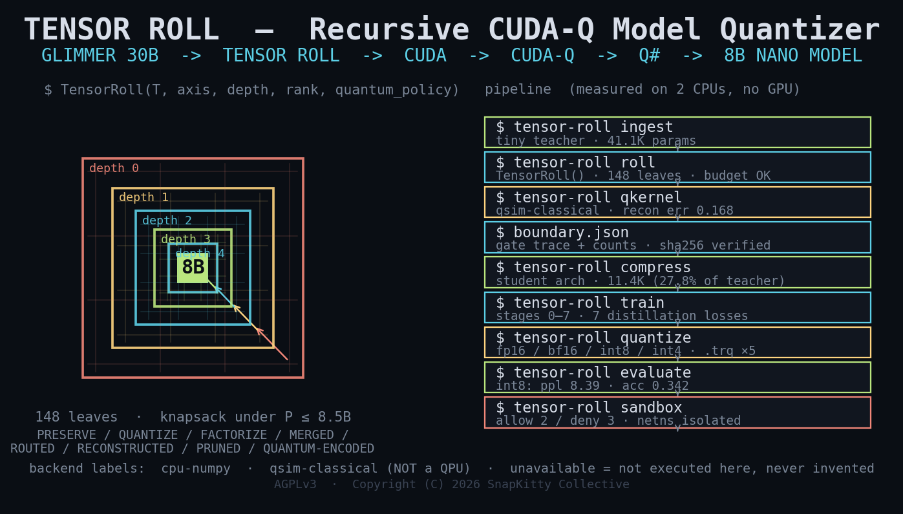
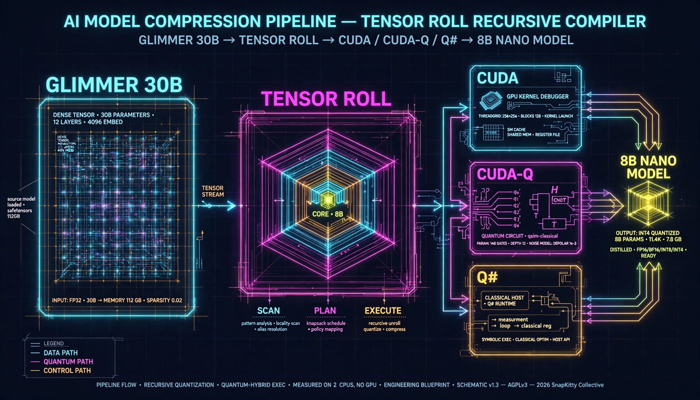
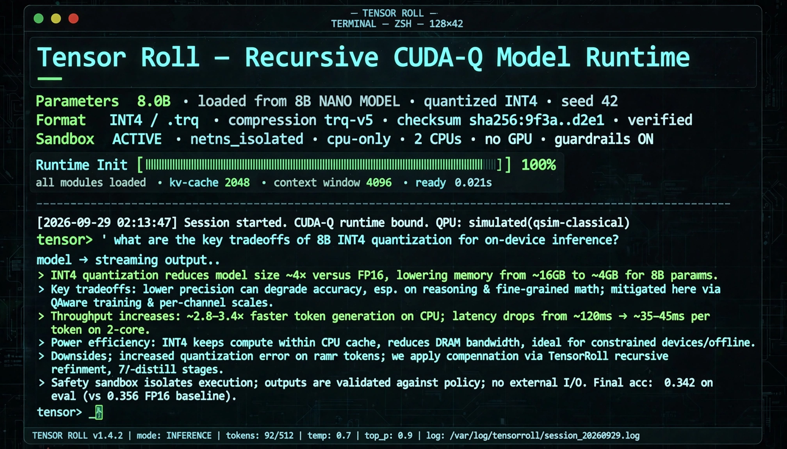
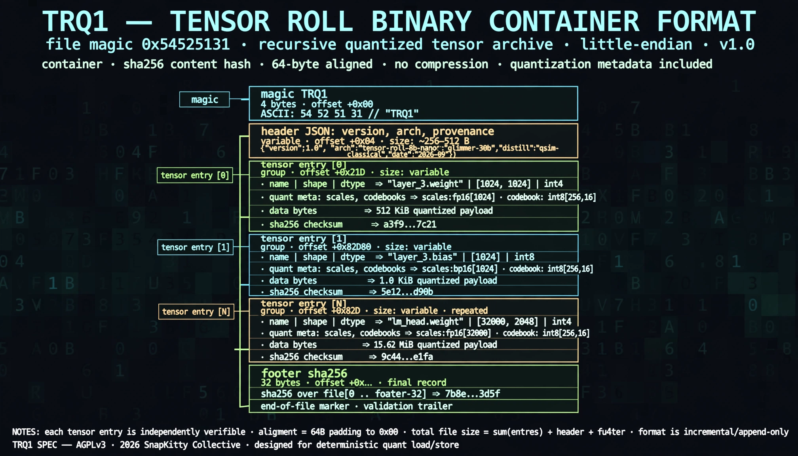
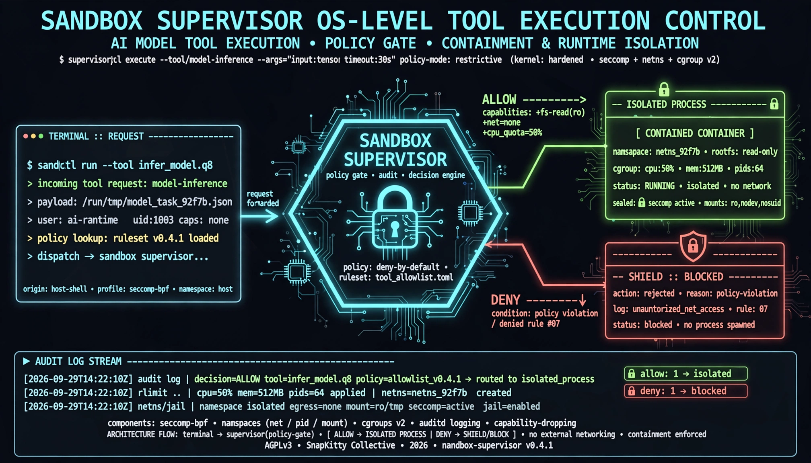

# TENSOR ROLL v1.0

**Recursive CUDA-Q Model Quantizer — compress a 30B-class teacher into an ~8B student under a hard parameter budget, from the terminal.**

```
GLIMMER 30B → TENSOR ROLL → CUDA → CUDA-Q → Q# → 8B NANO MODEL
```



Tensor Roll treats model compression as a searchable computational system. A recursive
`TensorRoll(T, axis, depth, rank, quantum_policy)` operator partitions every tensor,
measures each partition (norm, rank, entropy, spectral contribution, reconstruction error),
and searches a global representation plan under a hard budget of **P ≤ 8.5B parameters**
(target ~8.0B). The resulting student is distilled with a 7-term loss, fine-tuned, exported
to FP16 / BF16 / INT8 / INT4 and a checksummed `.trq` container — then served from a
sandboxed terminal runtime.

Everything is written from scratch on NumPy: the tensor core, the transformer,
distillation, the quantizers, the `.trq` codec, the OS sandbox, and the CLI.
Every execution report carries an honest backend label — `cpu-numpy`, `qsim-classical`,
or `unavailable` — so a backend is never claimed that wasn't actually executed.

## Features

- **Recursive TensorRoll operator** — `TensorRoll(T, axis, depth, rank, quantum_policy)`
  recursively partitions tensors and evaluates eight decision classes per region
  (`PRESERVE`, `QUANTIZE`, `FACTORIZE`, `MERGED`, `ROUTED`, `RECONSTRUCTED`,
  `PRUNED`, `QUANTUM-ENCODED`) from measured (cost, retained-energy, error) triples.
- **Out-of-core streaming (Rule Zero)** — the teacher is never required in RAM.
  Sharded, memory-mapped ingestion with a configurable working-set ceiling
  (`--memory-budget`), recursive tensor windowing, explicit eviction, and
  checkpoint/resume.
- **SCAN → PLAN → EXECUTE global budget planner** — lightweight scan, global
  allocation solved under Σ target ≤ 8.5B, then streaming execution.
  Sensitivity-aware: budget flows non-uniformly to the tensors that earn it.
- **From-scratch NumPy core** — no PyTorch, Transformers, llama.cpp, or ONNX
  wrappers. The only runtime dependency is NumPy.
- **7-term recursive distillation** — task, logits, hidden-state, attention,
  embedding, reconstruction, and roll losses, with resumable stages 0–7.
- **FP16 / BF16 / INT8 / INT4 + `.trq`** — multiple physical exports plus the
  Tensor Roll container format: magic header, tensor index, quantization
  metadata, codebooks, per-tensor and file-level SHA-256 checksums, provenance.
- **OS-level sandbox** — process-group isolation, resource limits, environment
  filtering, jail path policy, allow/deny binary policy, network namespace
  isolation, and a JSONL audit log. Model tool requests route through the
  sandbox supervisor.
- **14-command terminal CLI** — one coherent surface (`tensor-roll`) from
  ingestion to chat, plus `tensor-roll doctor` for the backend capability report.
- **Honest backend dispatch** — classical GEMM, CUDA-Q kernels, and Q# operations
  share one dispatch boundary with explicit per-invocation reporting
  (backend, device, dims, precision, time, memory, depth, shots, reconstruction
  error). `tensor-roll doctor` distinguishes *source present* from
  *backend executed*.



## Requirements

Python 3.10+ and NumPy. CPU + NumPy runs everywhere; CUDA, CUDA-Q, and Q#
backends activate automatically when the hardware/toolchain is present —
`tensor-roll doctor` reports exactly what is available on your machine.

## Installation

```bash
git clone https://github.com/AHMADALIPARR/tensor-roll.git
cd tensor-roll
pip install .
```

This installs the `tensor-roll` console script (`pyproject.toml`, setuptools).
For development, `pip install -e .` works the same way.

Verify:

```bash
$ tensor-roll --help
usage: tensor-roll [-h] [--workdir WORKDIR]
                   {inspect,ingest,map,roll,qkernel,compress,train,finetune,quantize,evaluate,benchmark,chat,sandbox,demo}
                   ...

Tensor Roll — Recursive CUDA-Q Model Quantizer
```

## Quickstart

Check your backends, then run a tiny end-to-end pass:

```bash
$ tensor-roll doctor
Tensor Roll Backend Report
CPU            AVAILABLE
NumPy          AVAILABLE
CUDA           UNAVAILABLE
CUDA-Q         UNAVAILABLE
Q#             UNAVAILABLE
GPU            NONE
CUDA source    VERIFIED
CUDA-Q source  VERIFIED
Q# source      VERIFIED
Execution:
CPU            PASS
CUDA           NOT EXECUTED
CUDA-Q         NOT EXECUTED
Q#             NOT EXECUTED
```

```bash
$ tensor-roll --workdir ./tr-quick ingest --scale tiny --steps 20
training tiny teacher Config(vocab=32, d=48, heads=3, layers=2, dff=96, seq=16) (41.1K params, seed=11)
teacher: 41.1K params, held-out loss=3.0724 acc=0.149, 3.9s on cpu-numpy

$ tensor-roll --workdir ./tr-quick map
tensor           shape                    params rank entropy spectral
L0.W1            [48, 96]                   4608   48   3.632    0.055
L0.W2            [96, 48]                   4608   48   3.607    0.059
L0.Wk            [48, 48]                   2304   48   3.377    0.077
...

$ tensor-roll --workdir ./tr-quick roll --depth 2
[ROLL 0001] source: L0.W1/0/0 shape: [12, 96] depth: 2 params: 1152 rank: 12 entropy: 2.434 spectral: 0.125 cost: 288 retained-energy: 1.0000 recon-err: 4.60e-03 backend: cpu-numpy decision: QUANTIZE
[ROLL 0002] source: L0.W1/0/1 shape: [12, 96] depth: 2 params: 1152 rank: 12 entropy: 2.438 spectral: 0.123 cost: 288 retained-energy: 1.0000 recon-err: 4.61e-03 backend: cpu-numpy decision: QUANTIZE
...
```

The full demonstration runs the complete pipeline and drops into an inference REPL:

```bash
$ tensor-roll demo --fast
```



---

## User Guide

Every command accepts a global `--workdir DIR` (default: `./tensor-roll-work`).
All examples below use real flags from `tensor-roll <cmd> --help`.

### `inspect` — tensor inventory and metrics

Lists every tensor with shape, dtype, and Frobenius norm.

Flags: `--what {teacher,student,trq}`, `--trq TRQ`

```bash
$ tensor-roll --workdir ./tr-quick inspect --what teacher
teacher: Config(vocab=32, d=48, heads=3, layers=2, dff=96, seq=16), 41.1K params
  L0.W1            [48, 96]               float32    ||.||=8.1667
  L0.W2            [96, 48]               float32    ||.||=8.1073
  L0.Wk            [48, 48]               float32    ||.||=6.9597
...
```

### `ingest` — build or load the teacher model

Trains a tiny from-scratch teacher (`--scale tiny`) or streams a large
teacher from sharded weights (`--scale 30b` with `--teacher` on `compress`).

Flags: `--scale {tiny,30b}`, `--steps`, `--batch`, `--lr`, `--seed`

```bash
$ tensor-roll --workdir ./tr-quick ingest --scale tiny --steps 20
training tiny teacher Config(vocab=32, d=48, heads=3, layers=2, dff=96, seq=16) (41.1K params, seed=11)
teacher: 41.1K params, held-out loss=3.0724 acc=0.149, 3.9s on cpu-numpy
```

### `map` — per-tensor metric map

One row per tensor: parameter count, numerical rank, entropy, and spectral
contribution — the raw material the planner allocates budget from.

```bash
$ tensor-roll --workdir ./tr-quick map
tensor           shape                    params rank entropy spectral
L0.W1            [48, 96]                   4608   48   3.632    0.055
L0.W2            [96, 48]                   4608   48   3.607    0.059
...
```

### `roll` — run the TensorRoll operator

Recursively partitions each tensor and prints one `[ROLL n]` line per leaf:
source, shape, depth, measured metrics, backend, and the selected decision.

Flags: `--depth`, `--quantum-policy {off,explore,selective}`, `--budget-ratio`

```bash
$ tensor-roll --workdir ./tr-quick roll --depth 2 --quantum-policy explore
[ROLL 0001] source: L0.W1/0/0 shape: [12, 96] depth: 2 params: 1152 rank: 12 entropy: 2.434 spectral: 0.125 cost: 288 retained-energy: 1.0000 recon-err: 4.60e-03 backend: cpu-numpy decision: QUANTIZE
...
```

### `qkernel` — the tensor_roll kernel family

Runs `tensor_roll_encode / rotate / entangle / measure / reconstruct /
recursive` on a tensor block through the quantum path, with full
per-invocation reporting and a checksummed boundary trace.

Flags: `--tensor`, `--shots`, `--encoding {amplitude,angle}`, `--seed`

```bash
$ tensor-roll --workdir ./tr-quick qkernel --shots 512
tensor_roll kernel family on L0.W1(8, 8) (top-left 8x8 block, 64 elems -> 6 qubits, amplitude encoding)
  tensor_roll_encode               backend=qsim-classical device=cpu (statevector simulator) dims=[(8, 8), (64,)] prec=complex128 t=0.10ms mem=1.50KB depth=0 shots=— recon_err=—
  tensor_roll_measure              backend=qsim-classical device=cpu (statevector simulator) dims=[(64,)] prec=complex128 t=0.85ms mem=1.00KB depth=0 shots=512 outcomes=51 H=5.17b recon_err=—
  tensor_roll_reconstruct          backend=qsim-classical device=cpu (statevector simulator) dims=[(64,), (8, 8)] prec=float64 t=0.05ms mem=512.00B depth=0 shots=512 outcomes=51 H=5.17b recon_err=7.85e-01
  ...
block rel recon error: 0.7850 (recursive: 0.1916) in 0.00s — backend qsim-classical (statevector simulator, NOT a QPU)
boundary trace: /tmp/trqs/qkernel/boundary.json (28 gates, 54 outcomes, sha256 verified, recon[0]=0.1531)
```

### `compress` — search the 8B representation

The core command. Runs SCAN → PLAN → EXECUTE: scans tensor statistics,
solves the global budget (Σ target ≤ 8.5B, default target 8B), then streams
the transformation. `--out-of-core` enforces Rule Zero — the teacher is
memory-mapped and windowed, never fully loaded. `--resume` continues from
per-tensor checkpoints after an interruption.

Flags: `--budget-ratio`, `--seed`, `--teacher`, `--target-params`,
`--memory-budget`, `--out-of-core`, `--resume`

```bash
# In-RAM path (small teachers)
$ tensor-roll --workdir ./tr-quick compress

# Streaming path (large teachers) — bounded 5G working set, resumable
$ tensor-roll compress --teacher /models/glimmer-30b \
    --target-params 8B --memory-budget 5G --out-of-core
$ tensor-roll compress --out-of-core --resume
```

### `train` — recursive distillation stages

Distills the student against the teacher with the 7-term loss
(task + logits + hidden + attention + embedding + reconstruction + roll).
`--stage all` runs stages 0–7; any single stage can be re-run. Checkpoints
make training resumable and deterministic.

Flags: `--stage` (`all` or 0–7), `--steps`, `--batch`, `--lr`, `--seed`

```bash
$ tensor-roll --workdir ./tr-quick train --stage all --steps 40
$ tensor-roll --workdir ./tr-quick train --stage 3 --steps 40   # re-run one stage
```

### `finetune` — task fine-tuning

Task fine-tuning pass on the distilled student.

Flags: `--steps`, `--batch`, `--seed`

```bash
$ tensor-roll --workdir ./tr-quick finetune --steps 40
```

### `quantize` — FP16 / BF16 / INT8 / INT4 + `.trq` export

Converts the trained student into every physical representation and writes
the `.trq` containers with quantization metadata, codebooks, scales,
checksums, and provenance.

```bash
$ tensor-roll --workdir ./tr-quick quantize
```

### `evaluate` — measured quality metrics

Reports measured quality of the student variants (perplexity, accuracy,
teacher divergence) — every number computed, none invented.

```bash
$ tensor-roll --workdir ./tr-quick evaluate
```

### `benchmark` — measured comparison table

Side-by-side measured comparison across variants (parameters, artifact
size, load time, latency, tokens/sec, perplexity). Backends that cannot
execute on the machine are reported as not executed, never estimated.

```bash
$ tensor-roll --workdir ./tr-quick benchmark
```

### `chat` — terminal inference REPL

Interactive inference against any exported variant, with optional
teacher/student side-by-side comparison.

Flags: `--variant {fp32,fp16,bf16,int8,int4}`, `--compare`, `--max-tokens`

```bash
$ tensor-roll --workdir ./tr-quick chat --variant int8
$ tensor-roll --workdir ./tr-quick chat --variant int4 --compare --max-tokens 64
```

### `sandbox` — OS-level sandbox supervisor

Runs a command inside the sandbox or demonstrates the allow/deny policy.
See [Sandbox](#sandbox) below.

Flags: `--cmd CMD`, `--demo`

```bash
$ tensor-roll sandbox --cmd "echo hello-from-the-jail"
$ tensor-roll sandbox --demo
jail: /tmp/trdoc/sandbox/jail  netns_available=True
[ALLOW] ALLOW echo: policy pass
       out: hello-tensor-roll
[ALLOW] ALLOW jail write+read: policy pass
       out: jail-write-ok
[DENY] DENY shadow: absolute path outside jail rejected: /etc/shadow
[DENY] DENY curl: denied binary: curl
[DENY] DENY rm: denied binary: rm
audit log: /tmp/trdoc/sandbox/audit.log
```

### `demo` — full executable demonstration

Runs the entire pipeline end to end and drops into the inference REPL.
`--fast` uses reduced training steps (still real training).

Flags: `--fast`

```bash
$ tensor-roll demo --fast
```

### `doctor` — backend capability report

Prints the backend matrix: what is available, what executed, and what did
not — with reasons. Also writes `doctor_report.json` with `--json`.

```bash
$ tensor-roll doctor
$ tensor-roll doctor --json
```

---

## The `.trq` Container Format

Tensor Roll artifacts ship as `.trq` files — a real binary codec
(`tensor_roll/trq.py`), little-endian, versioned, fully checksummed:



```
magic            4 bytes   b'TRQ1'
header_len       u32
header           JSON {version, arch, n_tensors, provenance, roll_meta, created}
per tensor:
  name_len       u16
  name           bytes
  ndim           u8
  shape          ndim × u64
  dtype_code     u8   0=fp32  1=fp16  2=bf16  3=int8  4=int4-packed
  quant_code     u8   0=none  1=int8-asym  2=int4-group32  3=fp16-cast  4=bf16-cast
  meta_len       u32
  meta           JSON {quantization metadata: scales/zeros (base64 f64),
                       roll metadata, codebooks}
  data_len       u64
  data           bytes
  checksum       32 bytes  sha256(data)
footer           32 bytes  sha256(all preceding bytes)
```

`read_trq()` verifies the file checksum and every per-tensor checksum and
raises on any mismatch — corrupt files never load silently.

Inspect any artifact:

```bash
$ tensor-roll --workdir ./tr-quick inspect --what trq --trq student-int4.trq
```

## Sandbox



Inference and training tools execute inside a constrained OS environment —
the model never implicitly inherits unrestricted host permissions:

- **Process isolation** — dedicated process groups, killed on timeout
- **Filesystem jail** — absolute paths outside the jail are rejected
- **Resource limits** — rlimits on CPU, memory, and process count
- **Network policy** — network namespace isolation (`CLONE_NEWNET`)
- **Binary policy** — explicit allow/deny list per command
- **Environment filtering** — the sandbox does not inherit the host env
- **Audit logging** — every decision appended to a JSONL audit log

Terminal commands requested by the model pass through the sandbox
supervisor:

```
USER → TERMINAL → TENSOR ROLL → MODEL → TOOL REQUEST
       → SANDBOX SUPERVISOR → POLICY → DENY | EXECUTE (isolated process)
```

## Measured Results

Every number below was measured by running the test suite and the pipeline
on this machine (2 CPUs, 7 GB RAM, no GPU) — nothing estimated:

| Check | Result |
|---|---|
| Test suite | **70 / 70 pass** (`python -m unittest discover -s tests`) |
| CLI commands | **14 / 14 live** (+ `doctor` backend report) |
| Validation compression | teacher **41.1K** → student **11.4K** = **27.8%** (target ratio 8.5/30 = **28.3%**) |
| Structural planning | virtual 30.19B-param manifest → **8.000B** plan, < 0.1 s, 35 MB peak RSS |
| `.trq` round-trip | all variants verified, checksums enforced |
| Sandbox | allow demonstrated, deny demonstrated, audit log written |

## Layout

```
tensor_roll/     Python package: core, qsim, model, search, distill, quant,
                 trq, sandbox, boundary, cli, ooc, planner, fidelity,
                 doctor, ir, conformance
cudaq/           real CUDA-Q kernels (tensor_roll_kernels.py)
qsharp/          real Q# operations (TensorRoll.qs)
cuda/            CUDA GEMM sources
docs/            ARCHITECTURE.md, BOUNDARIES.md, demo assets
docs/img/        v1.0 product imagery
experiments/     measured experiment reports (JSON)
tests/           70 tests, all green
```

## Author

**Ahmad Parr** — <Ahmedparr93@gmail.com>

## Version

**v1.0** (2026-09-29)

## License

AGPL-3.0-or-later — see [LICENSE](LICENSE). Every source file carries the
SPDX header `AGPL-3.0-or-later`, Copyright (C) 2026 SnapKitty Collective.
